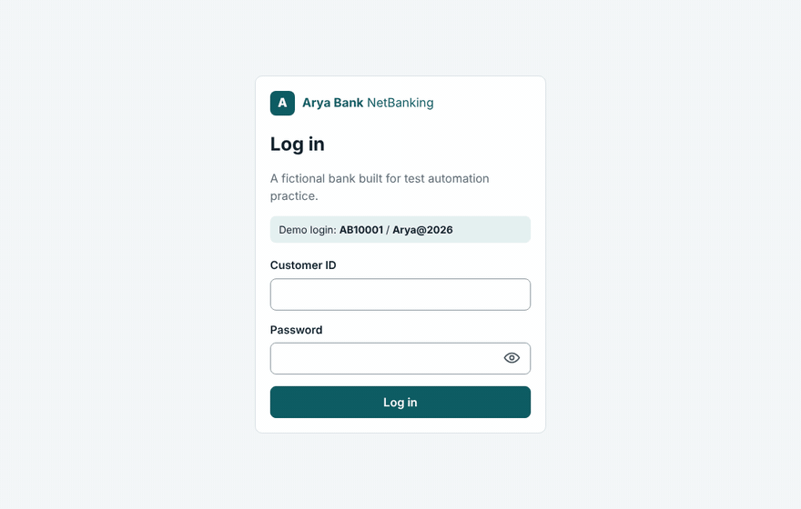

# Arya Bank Sandbox

**A fake bank with 16 planted bugs, for practising API, UI and database testing.**
One command to run, nothing to sign up for, and no real data anywhere.

[](https://github.com/byshivam/arya-bank-sandbox/actions/workflows/ci.yml)
[](https://github.com/byshivam/arya-bank-sandbox/pkgs/container/arya-bank-sandbox)
[](LICENSE)
[](https://codespaces.new/byshivam/arya-bank-sandbox)



*Typed ₹1500.75. The review screen says ₹1,500.00. That's one of the 16.*

## Why this exists

Practice sites for testers are usually shared, slow, often down, and you can't see their database.
This sandbox runs on your own machine, so you can:

- **break it as much as you like** and reset it in one call
- **look straight into the database** to check what really happened to the money
- **switch the bugs off** and compare against a correct bank
- practise the things real BFSI test teams do: idempotency, rounding, refunds, concurrency,
  contract drift, accessibility, mobile layouts, cross-browser issues

## Run it

```bash
docker run --rm -p 8000:8000 -p 4173:4173 ghcr.io/byshivam/arya-bank-sandbox
```

| What | Where |
|---|---|
| Net banking web app | http://localhost:4173 (login `AB10001` / `Arya@2026`) |
| Payments API docs (Swagger) | http://localhost:8000/docs |
| Health and current mode | http://localhost:8000/health |

No Docker? Click **Open in Codespaces** above, or run it with Python 3.10+ and Node 20+:

```bash
pip install -r services/payments-api/requirements.txt
python run_sandbox.py
```

## Practice mode and clean mode

| Mode | Planted bugs | Start it with |
|---|---|---|
| `practice` (default) | all 16 on | `docker run ... ghcr.io/byshivam/arya-bank-sandbox` |
| `clean` | none, a correct bank to compare against | `docker run ... -e ARYA_MODE=clean ghcr.io/byshivam/arya-bank-sandbox` |

Run both side by side (different ports) and the difference in behaviour is your evidence:

```bash
docker run --rm -p 8000:8000 -p 4173:4173 ghcr.io/byshivam/arya-bank-sandbox
docker run --rm -p 9000:8000 -p 5173:4173 -e ARYA_MODE=clean ghcr.io/byshivam/arya-bank-sandbox
```

You can also switch on just a few bugs with `PLANTED_BUGS=BUG-01,BUG-03` (API) or
`UI_BUGS=UI-05` (web). The ids are explained in the answers file, so only look them up
once you are done hunting.

## The challenge: find the 16 bugs

**[challenges/README.md](challenges/README.md)** lists all 16 as challenges with hints, grouped by
what you will need: plain API calls, database checks, parallel requests, accessibility tools,
a phone-sized screen, or a second browser.

Answers live in a separate file, **[challenges/ANSWERS.md](challenges/ANSWERS.md)**, so you don't
read a spoiler by accident. The planted bugs are also in the source code, so if you want the
full challenge, don't read `bugs.py` / `bugs.mjs` first.

## What's inside

```
services/
  payments-api/     FastAPI + SQLite: accounts, UPI-style transfers, refunds,
                    a double-entry ledger, idempotency keys          -> :8000
  netbanking-web/   Node (no dependencies): login, dashboard, send money,
                    beneficiaries, statements                         -> :4173
run_sandbox.py      starts both
challenges/         the 16 challenges, and the answers
```

**Payments API** (`:8000`)

| Endpoint | What it does |
|---|---|
| `GET /health` | status, mode, which bug ids are on |
| `POST /accounts` | open an account with an opening balance |
| `GET /accounts/{id}` | balance and status |
| `GET /accounts/{id}/transactions` | ledger entries, newest first |
| `POST /transfers` | send money (needs an `Idempotency-Key` header) |
| `GET /transfers/{id}` | one transfer |
| `POST /transfers/{id}/refund` | full refund |
| `POST /_admin/reset` | wipe everything and restore the seed data |

Money is always a **string** with two decimals (`"250.00"`), stored as integer paise. Every
movement writes a DEBIT and a CREDIT ledger entry, so you can check these in SQL:

1. every transaction's debits equal its credits
2. every account's balance equals its credits minus its debits
3. all balances, including the funding account `AB000000`, add up to `0.00`

To query the database yourself, mount a folder and open `data/arya_payments.db` with any SQLite tool:

```bash
docker run --rm -p 8000:8000 -p 4173:4173 -v "$PWD/data:/data" ghcr.io/byshivam/arya-bank-sandbox
```

**Net banking web app** (`:4173`): login with a 3-attempt lockout, account dashboard, send money with a
review step, add and delete beneficiaries, statements with date filters. `POST /api/_admin/reset`
restores the starting data.

## Seed data

On start the API fills an empty database with **25 customers, 60 transfers and 4 refunds**, generated
with [Faker](https://faker.readthedocs.io/) from a fixed seed. Everyone gets the same ids, names and
balances, so you can write "AB000007 can send more than it has" and others can reproduce it.

Export the customer list as CSV with `python -m arya_payments.seed --csv accounts.csv`
(run it from `services/payments-api`).

**Everything is synthetic**: invented people, Arya Bank's own account format (`AB000123`,
`ACC-100201`), a made-up IFSC prefix (`ARYB`), fake money. No real card, account or personal data
is generated or stored, ever.

## Test suites built on this sandbox

These suites run against the sandbox's code in this repo's CI, which checks that they still pass
on the clean build and catch every planted bug:

| Suite | Stack | Bugs |
|---|---|---|
| [payments-api-testing](https://github.com/byshivam/payments-api-testing) | Java 17, RestAssured, JUnit 5, JDBC, Pact, k6 | 7 API bugs |
| [netbanking-ui-testing](https://github.com/byshivam/netbanking-ui-testing) | Playwright + TypeScript, axe-core, visual regression | 9 UI bugs |

Built your own? Open a pull request to add it here.

## Contributing

New endpoints, new bugs, new challenges, translations of error messages, sample test suites in other
languages: all welcome. Start with **[CONTRIBUTING.md](CONTRIBUTING.md)** and the
[good first issues](https://github.com/byshivam/arya-bank-sandbox/labels/good%20first%20issue).
Ideas and questions go to [Discussions](https://github.com/byshivam/arya-bank-sandbox/discussions).
What's planned is in **[ROADMAP.md](ROADMAP.md)**.

## Contributors

<!-- ALL-CONTRIBUTORS-LIST:START - Do not remove or modify this section -->
<!-- ALL-CONTRIBUTORS-LIST:END -->

## Licence

[MIT](LICENSE). Arya Bank is fictional; any resemblance to a real bank or person is a coincidence.
